## リポジトリのフォーク

まずは、AWS CDK のリポジトリをご自身の GitHub アカウントにフォークします。

しかし本ワークショップでは、**本家の AWS CDK リポジトリではなく、ワークショップ用の擬似リポジトリを使用します。** そのため、以下のリポジトリをフォークしてください。

- <https://github.com/jaws-ug-cdk/aws-cdk-for-workshop>

### ブラウザでリポジトリを開き、右上の`Fork`ボタンを押す

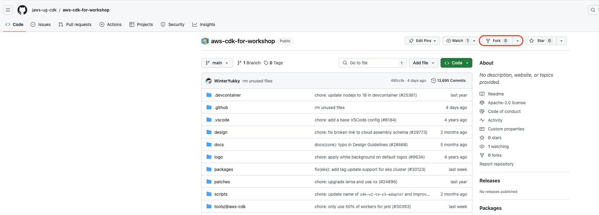

### 入力値はそのままで、右下の`Create fork`ボタンを押す

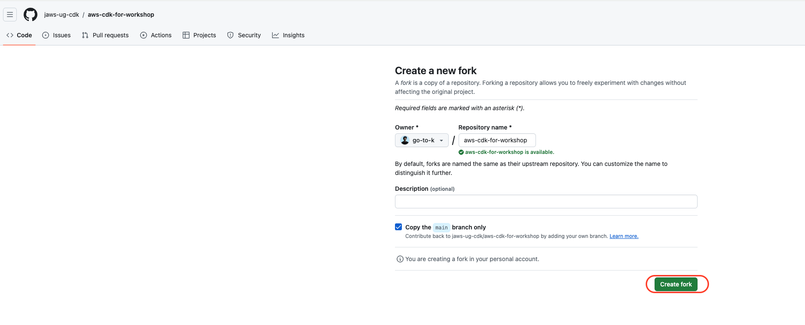

### 自分のアカウントにフォークされたリポジトリが開かれる

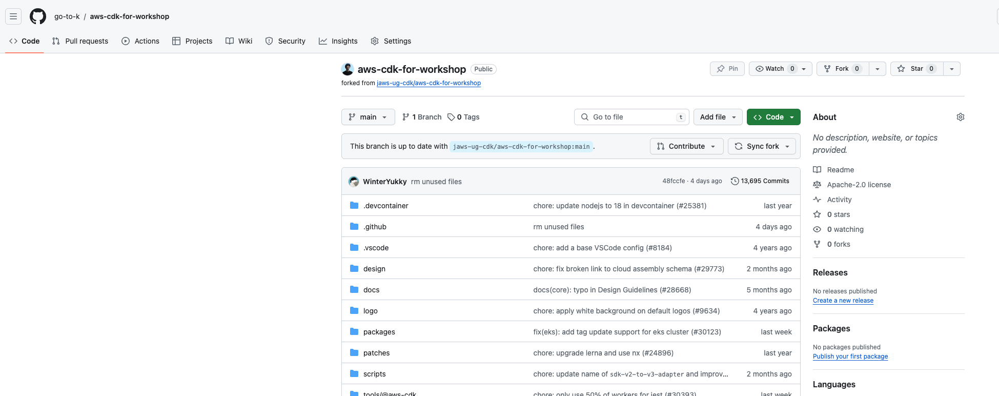

## リポジトリのクローン

次は、フォークしたリポジトリを開発環境にクローン(複製)します。

本ワークショップでは先ほど構築した EC2 で実際に開発を行うため、EC2 の VS Code 上でクローンをしてみます。

まず、EC2 の VS Code に移り、左側に表示されているバーから「リポジトリの複製」をクリックします。

すると上の入力欄に「GitHub から複製」という項目が表示されるので、クリックします。


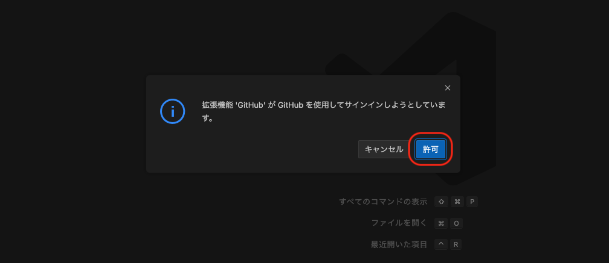

そして、先ほどフォークしたご自身のリポジトリ(`ユーザー名/aws-cdk-for-workshop`)を入力・選択します。


表示されたものに沿ってそのままクリックしていき、リポジトリを VS Code 上で開きます。

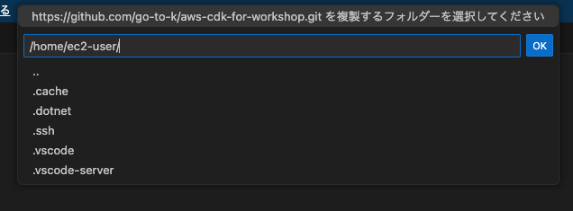

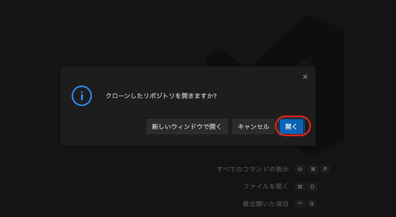

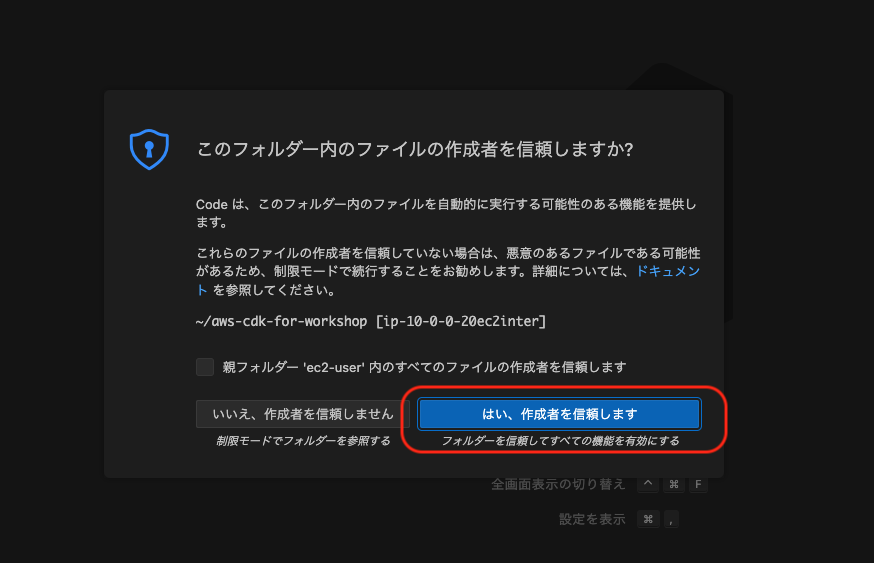

これでクローンが完了し、VS Code でコードを開けるようになりました。

## ブランチの作成・チェックアウト

ここでターミナルを開きます。

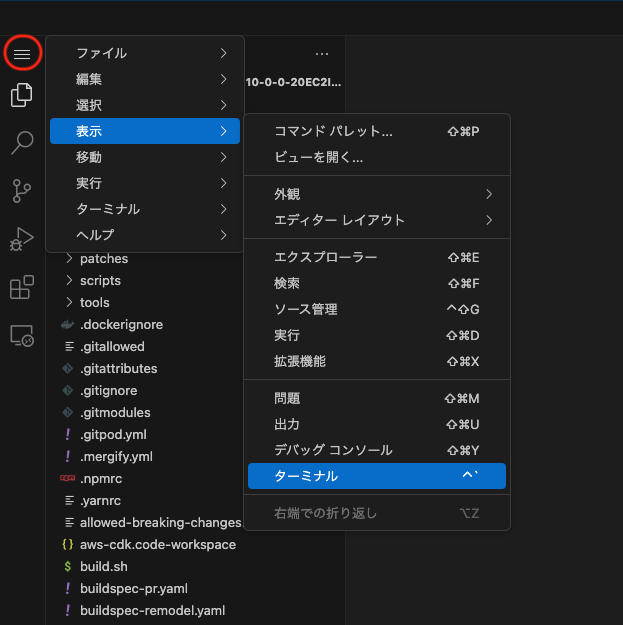

以下のコマンドを実行して、プルリクエストのための任意の名前のブランチを作成します。`git branch`コマンドで作成したブランチが確認できます。

```sh
git checkout -b workshop-guide-1

git branch
```


## モジュールのインストール

さて、ここでクローンした AWS CDK リポジトリのコードを開いてみましょう。

まず、左側のディレクトリ一覧から、`packages/aws-cdk-lib`をクリックして中身を表示してみてください。

これは`aws-cdk-lib`モジュールといい、AWS CDK のコンストラクトなど CDK を構成する大部分のコードが含まれています。

※他のディレクトリでは、`aws-cdk`には CLI としてのコードなど、`@aws-cdk`には alpha モジュールなど、`@aws-cdk-testing`には integration テストなどのテストコードが入っています。

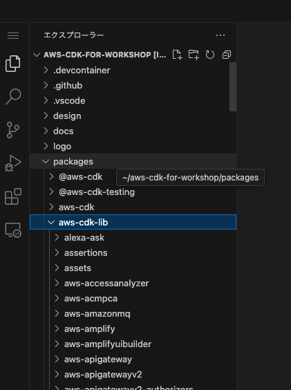

試しに、Amazon SQS のコンストラクトファイル(`packages/aws-cdk-lib/aws-sqs/lib/queue.ts`)を開いてみましょう。

すると SQS のコンストラクトなどのコードが入ったファイルが表示されます。しかし、最初の数行の import 文でエラーが出ていることがわかります。

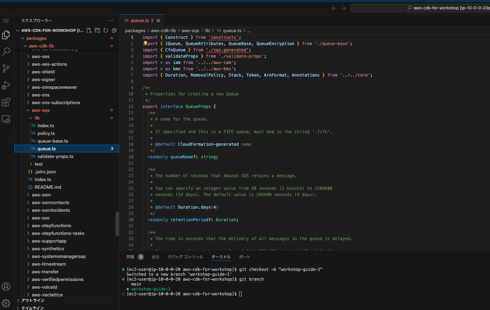

これは、まだ aws-cdk が依存するモジュールなどのインストールをしていないからです。次のコマンドでインストールしてみましょう。

```sh
yarn install
```


すると依存モジュールのインストールがされ、一部のエラーが解消されました。

## ビルド

しかし、まだエラーが出ているようです。`CfnQueue` (`sqs.generated`)という部分で出力されています。

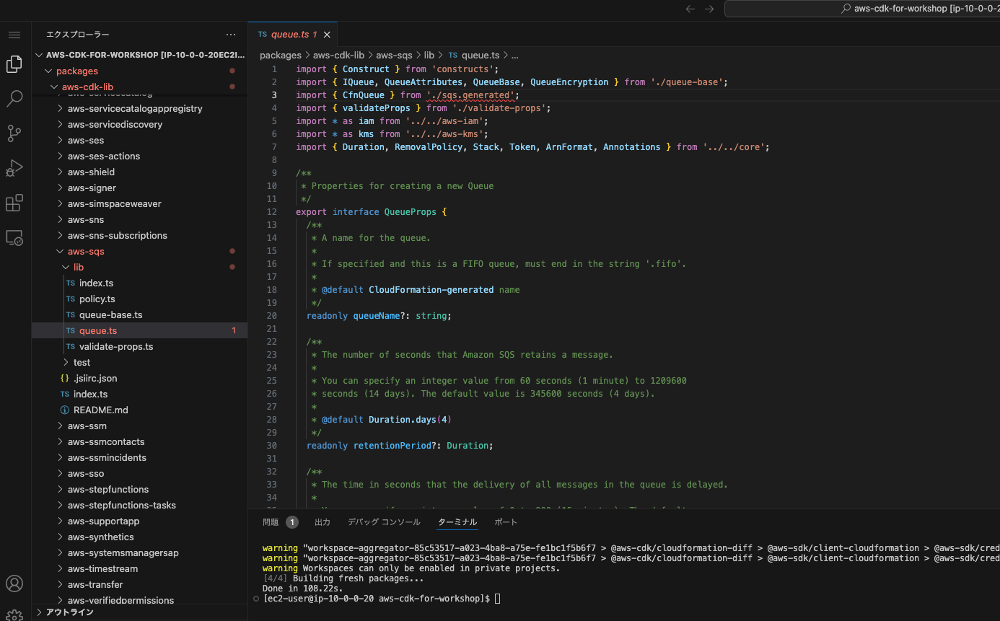

これは**L1 コンストラクトのモジュール**になりますが、AWS CDK では**L1 コンストラクトのファイルはビルドの際に自動生成**されます。

ここまでリポジトリのクローンから依存モジュールのインストールまでしましたが、**実はまだ「ビルド」をしていません**。

そこで、次の**ビルドコマンド**を投げてみましょう。

```sh
npx lerna run build --concurrency 4
```

※上記コマンドでは、**AWS CDK を構成するすべてのモジュール**をビルドしますが、たとえば`aws-cdk-lib`モジュールだけビルドする場合は、`--scope=aws-cdk-lib`オプションを指定することで、**ビルドするスコープを絞る**ことができます。

また、今回は並列実行数の上限を4に設定しています。これは実行環境に応じて適宜変更してください。

デフォルトのビルドでは**一度ビルドしたものはキャッシュされ**、次回ビルド時はそのキャッシュを使用します。しかし、このキャッシュにより思わぬビルドエラーになることも稀にあるため、その際は`--skip-nx-cache`というオプションを指定することで、**キャッシュを使わずにビルド**することができます。

またビルドの際、以下のようなエラーが起こることがあるため、その際は`export NODE_OPTIONS="--max-old-space-size=8192"`のように使用するメモリサイズを増加させることでエラーを回避することができます。**それを見越して、本ワークショップでは、あらかじめ EC2 で上記の環境変数の設定を行っています。**

```txt
ERROR: Reached heap limit Allocation failed - JavaScript heap out of memory
```

その他ビルドに関する説明は、[本家のコントリビュートガイド](https://github.com/aws/aws-cdk/blob/main/CONTRIBUTING.md#building-aws-cdk-lib)をご覧ください。


初回のフルビルドはとても時間がかかりますが、しばらく待ちましょう。

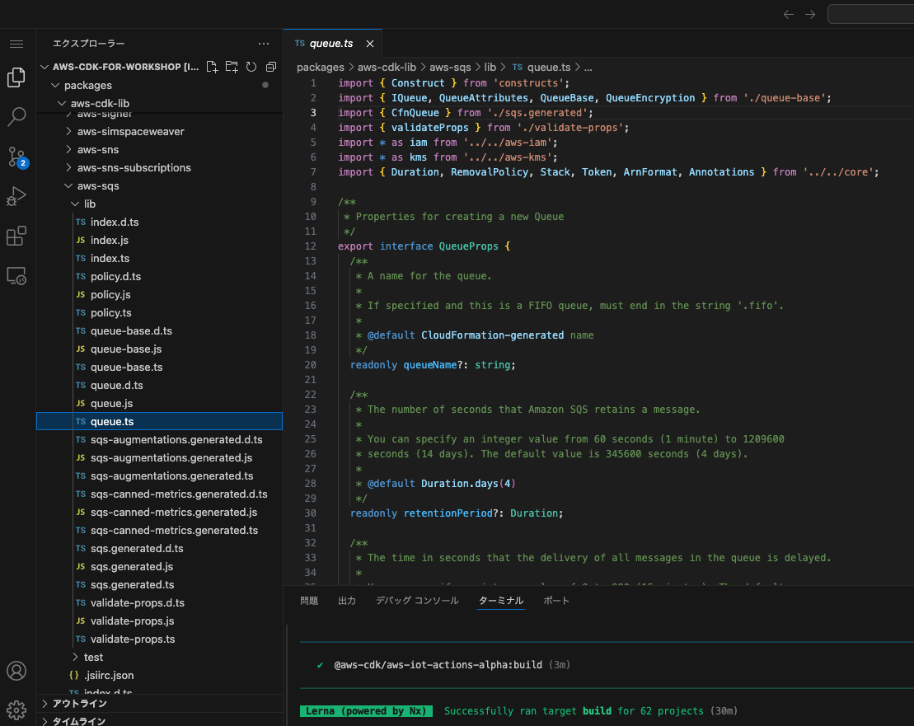

無事ビルドが完了し、L1 コンストラクトの import で出力されていたエラーも解消されました。

※フルビルドの際に以下の差分が発生していますが、これらは破棄してしまって構いません。

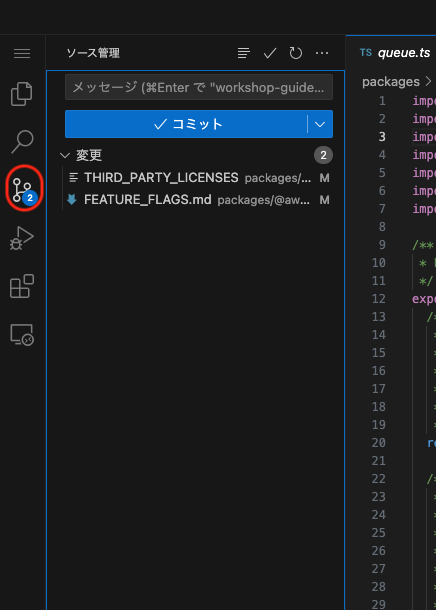


これで各ファイルを実際に変更する準備が整いました。

※各ファイルをダブルクリックすると、それぞれのファイルを新規タブで開けます。

- ユニットテストファイル: `packages/aws-cdk-lib/aws-sqs/test/sqs.test.ts`

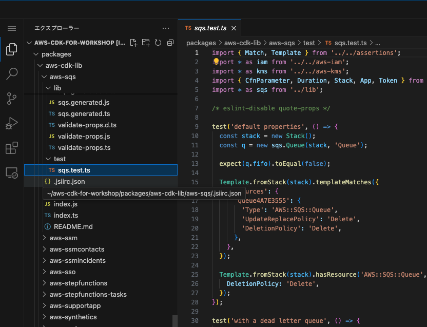

- integration テストファイル: `packages/@aws-cdk-testing/aws-sqs/test/integ.sqs.ts`

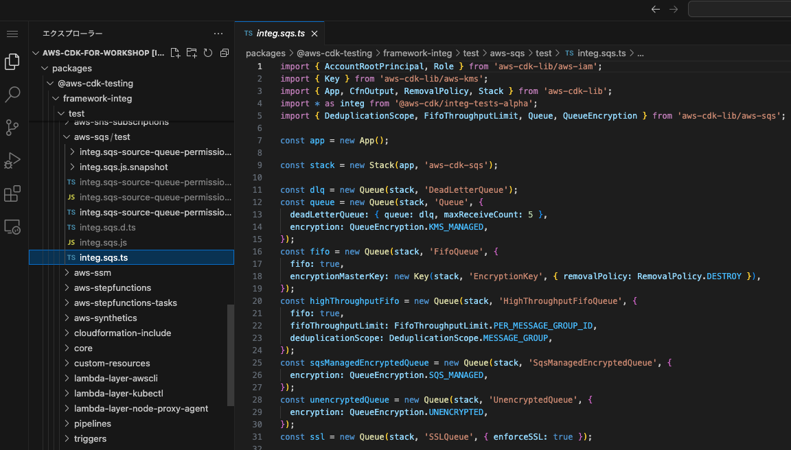
