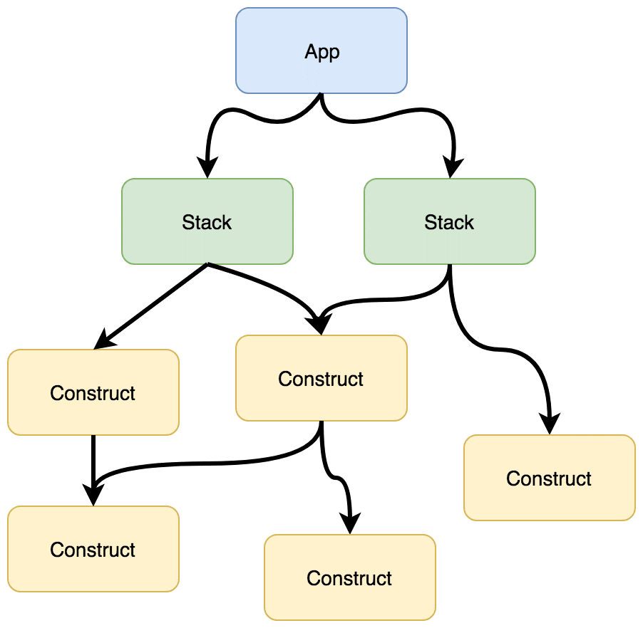
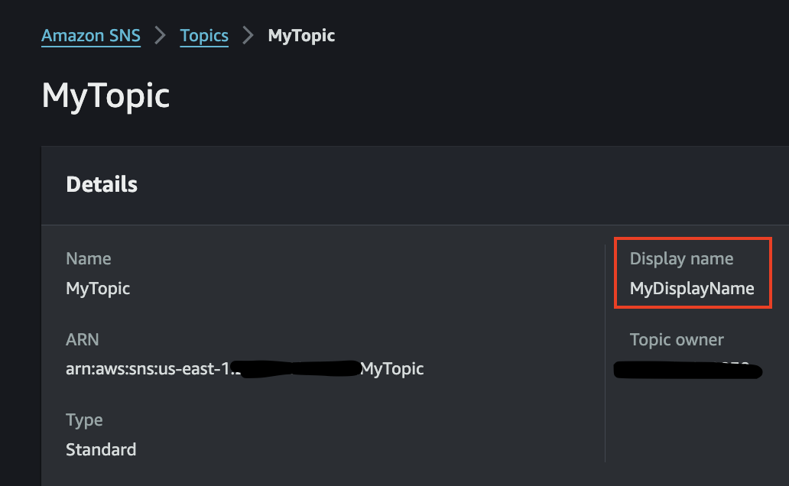

## 前提知識

### CDKアプリケーションの構成

CDKアプリケーションはAppをルートとして、複数のStack, Constructから構成されています。



このうち、Constructは以下の3つのタイプに分けられます。

- L1 Construct
  - Cloudformationのリソースと1対1に対応するConstruct
  - Cloudformationから**自動生成**される
- L2 Construct
  - L1を抽象化したConstruct
  - 型情報や関数などが追加されている
  - ユーザの**Pull Requestで作成・更新**する
- L3 Construct
  - 複数のL1, L2を組み合わせたConstruct

:::note
CDKのコントリビューションはL2(3) Constructに対してのみ行います。
:::

### L2 Constructへの引数追加

Cloudformationで新しい引数が作成された場合、L1 Constructには自動で追加されますが、L2 Constructには自動では追加されません。

L2で使うためには、引数を追加する修正を手動で行う必要があります。

```ts {4,13}
// aws-cdk/packages/aws-cdk-lib/aws-sns/lib/topic.ts
export interface TopicProps {
  ..., // 既存のプロパティ
  displayName?: string;
};

export class Topic extends TopicBase {
  constructor(scope: Construct, id: string, props: TopicProps) {
    super(scope, id, props);

    const resource = new CfnTopic(this, 'Resource', {
      ...,
      displayName: props.displayName
    });
  };
};
```

このように、L2で未対応の引数を追加するPRをこれから作成してみましょう。

## 概要

SNS Topicには表示名を設定することができ、Eメール通知における件名などに利用されます。



[Cloudformation](https://docs.aws.amazon.com/AWSCloudFormation/latest/UserGuide/aws-resource-sns-topic.html#cfn-sns-topic-displayname)及び[CDKのL1コンストラクト](https://docs.aws.amazon.com/cdk/api/v2/docs/aws-cdk-lib.aws_sns.CfnTopic.html#displayname)では `DisplayName` というプロパティが提供されており、これを利用することで表示名を設定することができます。

```ts {2}
const topic = sns.CfnTopic(this, 'MyTopic', {
  displayName: 'MyTopicDisplayName'
})
```

しかし、ワークショップ向けCDKのL2コンストラクト(sns.Topic)では `displayName` がサポートされていません。そこで、L2コンストラクトに `displayName` プロパティを追加してみます。

## 目標

PRの作成には以下の要素を含める必要があります。

- L2コンストラクト(packages/aws-cdk-lib/aws-sns/lib/topic.ts)のコード変更
  - `TopicProps`に`displayName`プロパティを追加
  - `Topic`クラスのconstructor関数中の`CfnTopic`クラスのインスタンス作成時に`displayName`プロパティを設定
- ユニットテスト(packages/aws-cdk-lib/aws-sns/test/topic.test.ts)の追加
  - `displayName`プロパティがCloudformationテンプレートに正しく反映されるか
- 統合テスト(packages/@aws-cdk-testing/framework-integ/test/aws-sns/test)の追加
  - `displayName`を設定したSNS Topicが正しく作成されるか
- READMEの更新
  - 機能追加に関する説明を追加

## 手順

### ブランチ作成

まずは、この機能追加用のブランチを作成します。

```sh
git switch -c add-sns-topic-display-name
```

### L2コンストラクトのコード変更

#### `TopicProps`へ`displayName`の追加

`aws-cdk/packages/aws-cdk-lib/aws-sns/lib/topic.ts`を開き、`TopicProps`に`readonly`な`displayName`プロパティを追加します。

既存のPropsに新たな引数を追加するとき、必須なものを追加すると破壊的変更になってしまうため、optionalなプロパティとして追加することに注意してください。

jsdocには`displayName`プロパティの説明を[Cloudformationのドキュメント](https://docs.aws.amazon.com/AWSCloudFormation/latest/UserGuide/aws-resource-sns-topic.html#cfn-sns-topic-displayname)からコピーしてきましょう。

また、上記の通りoptionalなプロパティであることを示すために`?`を付け、デフォルトの挙動を`@default`に記述します。

```ts {4-9}
// aws-cdk/packages/aws-cdk-lib/aws-sns/lib/topic.ts
export interface TopicProps {
  ..., // 既存のプロパティ
  /**
   * The display name to use for an Amazon SNS topic with SMS subscriptions.
   *
   * The display name must be maximum 100 characters long, including hyphens (-), underscores (_), spaces, and tabs.
   *
   * @default - no display name
   */
  readonly displayName?: string;
};
```

:::note
jsdocには`@see`にてAWS公式ドキュメントの参考リンクを追加することができます。
このとき、リンク先の言語を英語にすることを忘れないでください。

```ts
@see https://docs.aws.amazon.com/sns/latest/dg/sns-create-topic.html
```
:::

#### `Topic`クラスのconstructor関数の変更

`Topic`クラスのconstructor関数内で、`CfnTopic`クラスのインスタンス作成時に`displayName`引数を設定します。

```ts {8}
// aws-cdk/packages/aws-cdk-lib/aws-sns/lib/topic.ts
export class Topic extends TopicBase {
  constructor(scope: Construct, id: string, props: TopicProps) {
    super(scope, id, props);

    const resource = new CfnTopic(this, 'Resource', {
      ..., // 既存のプロパティ
      displayName: props.displayName
    });
  };
};
```

以上で機能修正は完了です。一連の内容をcommitしておきましょう。

### ユニットテストの追加

#### テストファイルの修正

続いてユニットテストを追加します。テストファイルは`aws-cdk/packages/aws-cdk-lib/aws-sns/test/topic.test.ts`です。

ユニットテストでは、`displayName`プロパティがCloudformationテンプレートに正しく反映されるかを確認します。

```ts {2-12}
// aws-cdk/packages/aws-cdk-lib/aws-sns/test/topic.test.ts
test('specify displayName', () => {
  const stack = new cdk.Stack();

  new sns.Topic(stack, 'MyTopic', {
     displayName: 'MyDisplayName',
  });

  Template.fromStack(stack).hasResourceProperties('AWS::SNS::Topic', {
    DisplayName: 'MyDisplayName',
  });
});
```

#### テストの実行

ユニットテストを実行して、テストが正常に通ることを確認します。

```sh
cd packages/aws-cdk-lib
yarn test aws-sns/test/topic.test.ts
```

これでユニットテストの追加は完了です。一連の内容をcommitしておきましょう。

:::note
バリデーションコードを追加した場合は、そのバリデーションに対するテストも追加します。

今回は`displayName`が100文字を超える場合はエラーを返すバリデーションを追加したとします。

引数の型がstringまたはnumberの場合、Tokenが渡される可能性も考慮して、`Token.isUnresolved()`を使ったバリデーションも行います。詳しくはこちらの[ドキュメント](https://aws.amazon.com/jp/builders-flash/202406/cdk-validation/#03-01)を参照してください。

```ts {6-8}
// aws-cdk/packages/aws-cdk-lib/aws-sns/lib/topic.ts
export class Topic extends TopicBase {
  constructor(scope: Construct, id: string, props: TopicProps) {
    super(scope, id, props);

    // displayNameが100文字を超える場合はエラー
    if (props.displayName && !Token.isUnresolved(props.displayName) && props.displayName.length > 100) {
      throw new Error(`displayName must be less than 100 characters, got ${props.displayName.length}`);
    }

    const resource = new CfnTopic(this, 'Resource', {
      ..., // 既存のプロパティ
      displayName: props.displayName
    });
  };
};
```

testでは101文字の`displayName`を設定し、Errorがthrowされることを確認します。

```ts
// aws-cdk/packages/aws-cdk-lib/aws-sns/test/topic.test.ts
test('throw error when displayName is too long', () => {
  const stack = new Stack();

  expect(() => {
    new Topic(stack, 'MyTopic', {
      displayName: 'a'.repeat(101)
    });
  }).toThrowError('displayName must be less than 100 characters, got 101');
});
```

:::

### 統合テストの追加

#### テストファイルの作成

続いて統合テストを追加します。統合テストでは、`displayName`を設定したSNS Topicが正しく作成されるかを確認します。

テストファイルは`packages/@aws-cdk-testing/framework-integ/test/aws-sns/test`に作成します。
今回は新規の統合テストファイルを作成します。

```ts
// packages/@aws-cdk-testing/framework-integ/test/aws-sns/test/integ.sns-display-name.ts
import { App, Stack, StackProps } from 'aws-cdk-lib';
import { Topic } from 'aws-cdk-lib/aws-sns';
import * as integ from '@aws-cdk/integ-tests-alpha';

// テスト用のStackを定義
class TestStack extends Stack {
  constructor(scope: App, id: string, props?: StackProps) {
    super(scope, id, props);

    new Topic(this, 'MyTopic', {
      topicName: 'MyTopicName',
      // displayNameを設定
      displayName: 'MyDisplayName',
    });
  }
}

const app = new App();

const stack = new TestStack(app, 'DisplayNameTopicTestStack');

// 統合テストの実行
new integ.IntegTest(app, 'SnsTest', {
  testCases: [stack],
});
```

#### 統合テストの実行

統合テストを実行して、テストが正常に通ることを確認します。

```sh
# Topicクラスを含めたSNSのコンストラクトを再ビルド
cd /packages/aws-cdk-lib/aws-sns
yarn tsc

cd packages/@aws-cdk-testing/framework-integ/test/aws-sns
# integ ファイルのビルド/トランスパイルをして、javascript ファイルを生成
yarn tsc
# 実際にinteg テストを実行する
yarn integ aws-sns/test/integ.sns-display-name.js --update-on-failed
```

自動でCloudformationテンプレートの作成, スタックのデプロイ及び削除が行われます。エラーなく完了すれば統合テストも完了です。

作成したテストファイル及び生成されたスナップショットファイルをコミットしておきましょう。

### READMEの更新

最後に、この機能追加に関する説明をREADMEに追加します。

```md
// aws-cdk/packages/aws-cdk-lib/aws-sns/README.md
## Display Name

You can set a display name for the topic.
To set a display name, use the `displayName` property:

```ts
const topic = new sns.Topic(this, 'Topic', {
  displayName: 'MyDisplayName',
});
\```

```

以上で必要な変更はすべて完了しました。

### PRの提出

最後にPRを提出します。

[PRルール](/2-コントリビュートの流れとルール/contribution-flow-rule/#pr-ルール)に則り、以下のようなPRを作成しましょう。

|項目|内容|記入例|
|-|-|-|
|PRタイトル|PRの目的|feat(sns): add `displayName` property to a Topic|
|Issue # (if applicable)|関連するIssue番号|Closes #1|
|Reason for this change|変更理由|We can set a display name for an SNS topic from cloudformation, but this was not supported in the AWS CDK L2 construct.|
|Description of changes|変更内容の詳細|Add `displayName` property to `TopicProps` and set it in the `CfnTopic` constructor.|
|Description of how you validated changes|変更の検証方法|Added both unit and integration tests.|

以上でPRの作成は完了です。おつかれさまでした！
